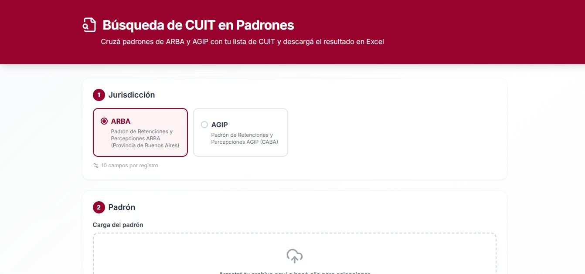

# Búsqueda de CUIT en Padrones

Herramienta web para cruzar los padrones de alícuotas de **ARBA** y **AGIP** con una lista de CUIT y descargar el resultado en Excel.

🔗 **[busqueda-cuit-padrones.vercel.app](https://busqueda-cuit-padrones.vercel.app)**



## El problema

Todos los meses ARBA y AGIP publican sus padrones de alícuotas de percepción y retención: archivos de texto con millones de líneas que no se pueden abrir en Excel. Buscar las alícuotas de los proveedores o clientes de una empresa implica un proceso manual, lento y propenso a errores.

Esta app nació de esa necesidad real en mi trabajo como analista impositiva.

## Qué hace

- Permite elegir la jurisdicción (ARBA o AGIP); cada una tiene su propio diseño de registro configurado.
- Acepta el padrón tal como se descarga (`.zip` o `.txt`).
- Recibe la lista de CUIT pegada o en un archivo, con o sin guiones, y detecta duplicados e inválidos.
- Genera un Excel con todos los campos del padrón para los CUIT buscados. Los CUIT no encontrados quedan al final.
- Muestra un resumen en pantalla: cuántos se encontraron y cuáles faltan.

**Privacidad:** todo el procesamiento ocurre en el navegador. Ni el padrón ni la lista de CUIT se suben a ningún servidor.

## Detalles técnicos

- **Streaming en un Web Worker:** el padrón se lee línea por línea sin cargarlo entero en memoria, así que la interfaz no se congela. Probado con padrones de más de 5 millones de líneas.
- **Descompresión de ZIP en streaming** con fflate.
- **Parseo por `split(";")`** en lugar de un parser CSV, porque los padrones pueden traer comillas sueltas que hacen que un parser CSV pierda filas sin avisar.
- **Diseños de registro como configuración** (`src/config/padrones.ts`), para sumar nuevas jurisdicciones sin tocar la lógica.
- **Excel con ExcelJS:** CUIT y números de grupo como texto (no se pierden ceros), alícuotas numéricas, fechas reales y encabezados congelados con autofiltro.

## Stack

React · TypeScript · Vite · Tailwind CSS · fflate · ExcelJS · Vercel

## Correr localmente

```bash
git clone https://github.com/FlorenciaCracogna/busqueda-cuit-padrones.git
cd busqueda-cuit-padrones
npm install
npm run dev
```

## Autora

**Florencia Cracogna**, Contadora Pública y desarrolladora Fullstack.
[Portfolio](https://florenciacracogna.vercel.app) · [GitHub](https://github.com/FlorenciaCracogna)